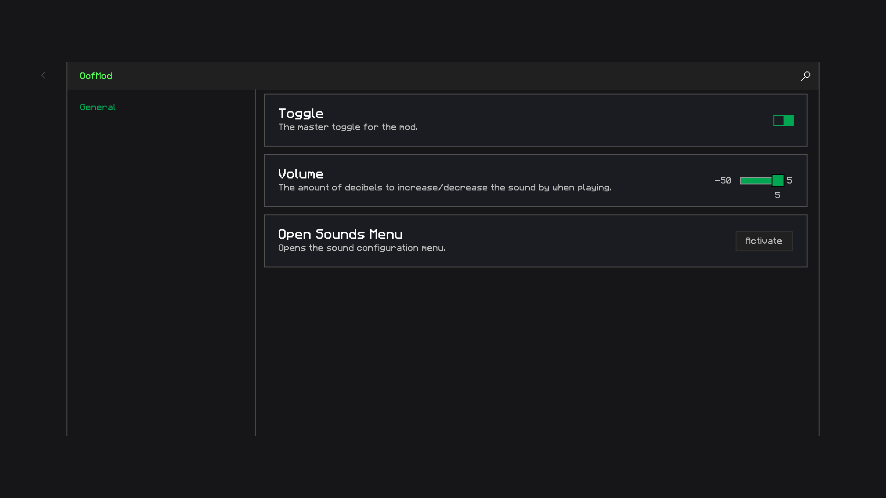
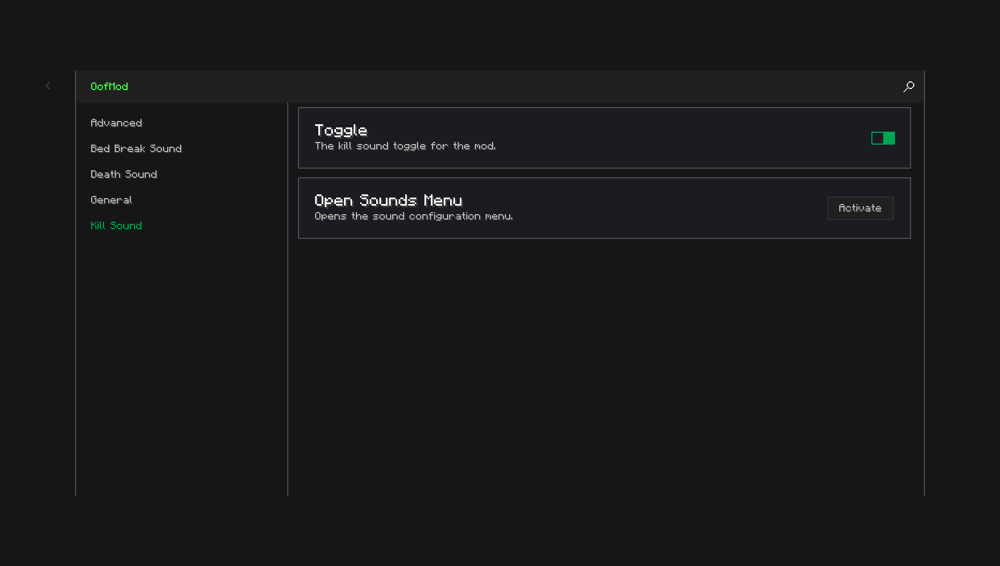
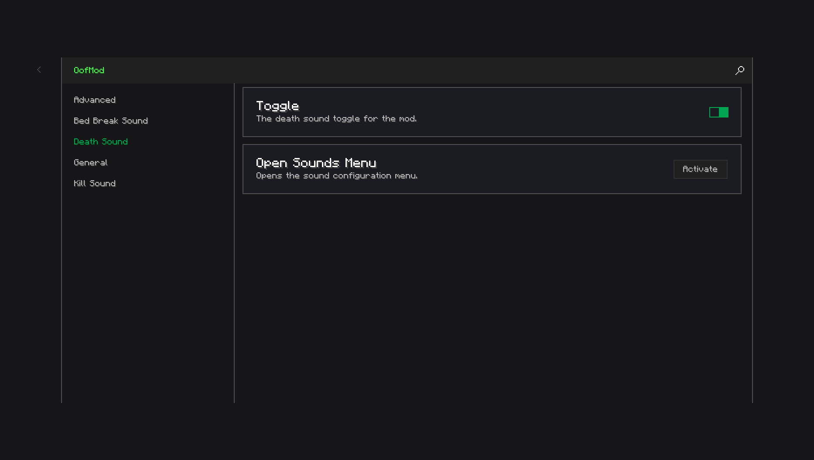
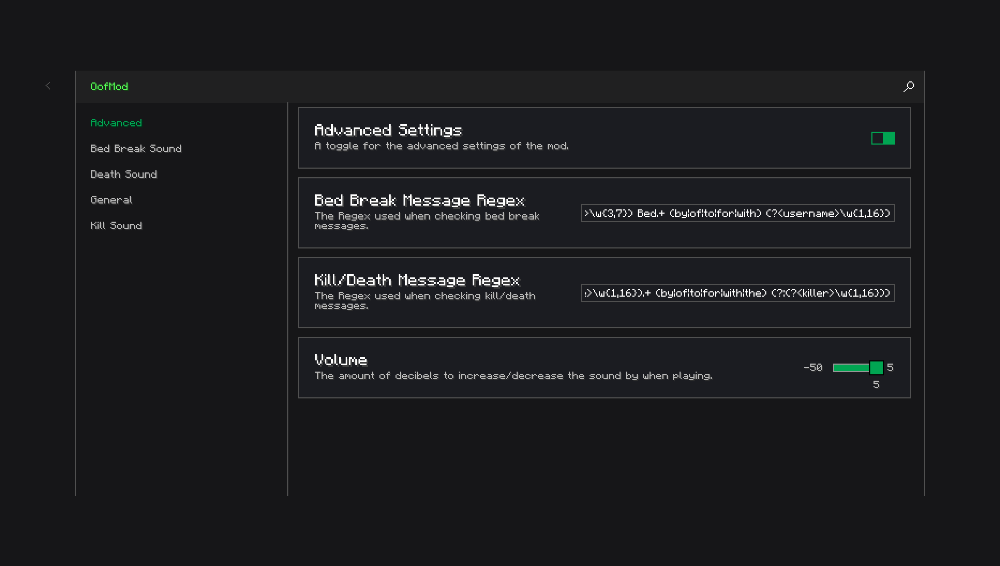
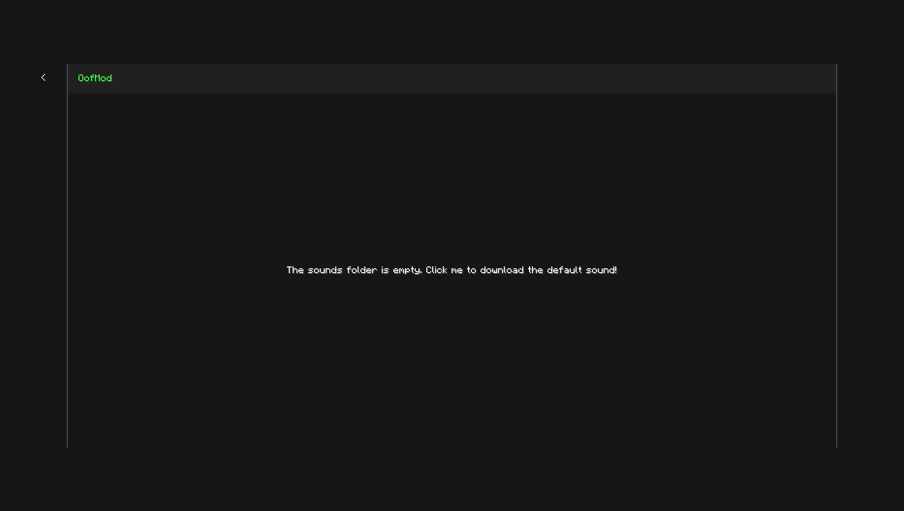
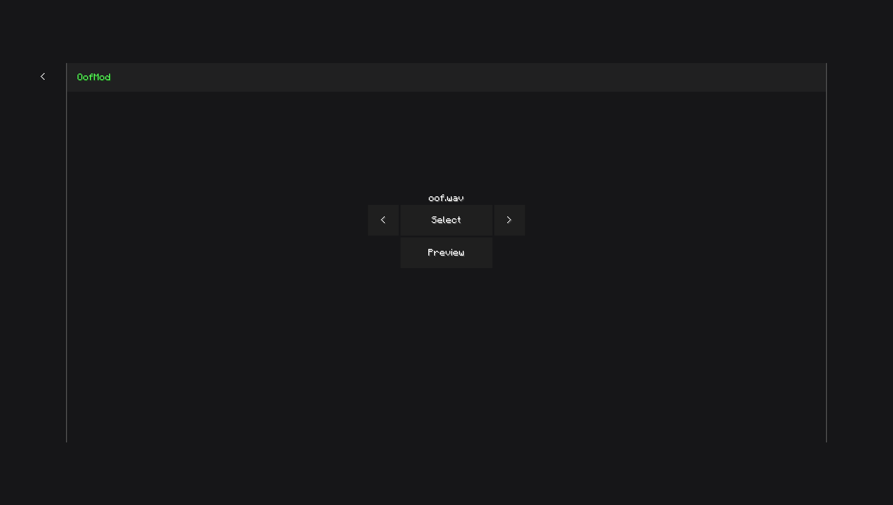

<div align="center">

# `OofMod v4`
The same old OofMod, but better!

</div>


\
[](https://discord.gg/dFb277Kexf)

## Changes
```diff
+ Added Essential.
+ Rewritten command to use Essential.
+ Rewritten settings to use Vigilance.
+ Replaced sound config menu with custom screen using Essential's design.
+ Added a kill sound type.
+ Added a death sound type.
+ Added a bed break sound type.
+ Added overall better error handling.

- Removed ModCore.
- Removed multiple game-breaking bugs.
```

## Screenshots








## Permission
I have asked Powns if I may make and distribute this fork as an official unnofficial version of OofMod.

