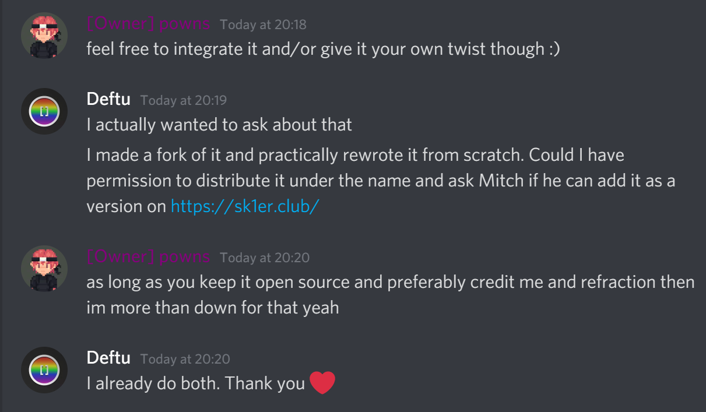

# [`OofMod Reborn`]
[Support][discord]
·
[Make a Request][issues]

[][discord]

## Permission
I have asked Powns if I
may make this recreation
of his mod. In this discussion,
we discussed a **fork** of the
original. Now, this is a standalone
project with none of the original's code.

**Original OofMod by [Powns][powns]**\
**This project is licensed under [LGPL-3.0][lgpl3]**\
**&copy; 2022 Deftu**

[discord]: https://shr.deftu.xyz/discord
[issue]: /issues/new
[powns]: https://powns.dev
[lgpl3]: https://www.gnu.org/licenses/lgpl-3.0.en.html
